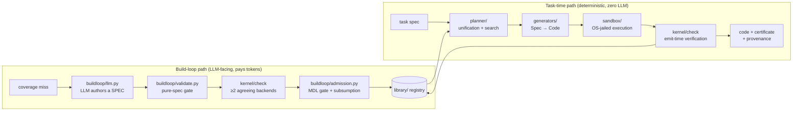

# Architecture

A structural map of the Certified Generator Bootstrap (CGB) system: what the
components are, which of the two execution paths each sits on, and where trust
enters and flows. For the thesis, constraints, and walkthroughs see
[README.md](README.md); for the trusted computing base enumerated line by line
see [TRUST.md](TRUST.md). This document is the "how the pieces fit" companion
to those.

> Status: v1 draft under active revision. Open questions for the maintainer
> are marked `[Q]` inline.

## The one-paragraph version

An LLM is permitted to author **declarative specifications only** — never
general-purpose code. A small fixed **kernel** adjudicates every artifact via
at least two independent outsourced checkers; a registry of **generators**
(programs of type `Spec → Code`) does all code emission inside an OS-level
sandbox; **MDL accounting** decides what is worth admitting; and every
artifact records provenance. Trust flows downhill compiler-bootstrap style:
verification begets verification.

## Two paths, one hub, one shared state

Everything in the repo sits on one of two strictly separated execution paths.
Both route through the kernel (the fixed hub) and read/write the registry
(the shared state).

- **Task-time path** (`cgb.py run SPEC` → `run/`): spec → planner unifies
  against registered grammars → generator chain emits code → sandboxed
  execution → emit-check-tier links verified by the kernel → code + composed
  certificate + provenance. Contains **no LLM calls**, enforced by
  `common.task_time_guard()` (`CGB_TASK_TIME`); same spec + same registry
  state ⇒ byte-identical output.
- **Build-loop path** (`cgb.py build --policy …` → `buildloop/`): a steering
  policy picks a coverage miss → the LLM proposes a spec →
  `buildloop/validate.py` rejects anything that is not a pure spec → the
  kernel adjudicates → the MDL admission gate accepts only candidates that
  strictly reduce total corpus description length → admitted generators enter
  the registry at emit-check tier. Failures return an `ErrorTranscript` that
  drives refinement (bounded rounds).

Trust mechanisms that cut across both paths:

- **Two-tier trust model** — *emit-check* tier: every output individually
  verified at emission; *universal* tier: the generator itself proven correct
  for all specs (`buildloop/promote.py`), removing the per-emission check.
- **Dual-checker rule** — no single checker's verdict admits anything; two
  independent evidence channels must agree, and disagreements are recorded as
  first-class events (see `demo_differential.py`, milestone m6).
- **MDL as the one currency** — description-length accounting
  (`buildloop/mdl.py`, `buildloop/dl.py`) is both the admission gate and the
  steering signal (see [COMPRESSION.md](COMPRESSION.md),
  [SPECULATION.md](SPECULATION.md)).

## Component map

Trust status legend: **fiat** = trusted axiomatically (in the TCB),
**cert** = trusted only via kernel certificates, **untrusted** = adjudicated
or measured output.

| Directory | Role | Trust |
|---|---|---|
| `kernel/` | The only fiat-trusted component. `check(artifact, contract) → Certificate \| ErrorTranscript`; backend wrappers for Hypothesis, Dafny/Z3, Z3+CVC5, Lean 4 (`backends.py`); certificate records (`certs.py`); rung meta-interpreter (`rung.py`); ∃-anchor verdict lattice (`verdict_lattice.py`). | fiat |
| `generators/` | All `Spec → Code` machinery: the codec seed (`ksy_model.py`, `codec_model.dfy`, `dafny_gen.py`, `refcodec.py`), the tower extensions (ABNF, JSON codecs, tool contracts, constraints, protocols, temporal monitors, services), and the formalization family (`math_reading.py`, `math_compile.py` → Lean). | cert |
| `planner/` | Deterministic spec-to-generator matching: unification (`__init__.py`), beam search over admission sequences (`search.py`), min-DL choice search (`choices.py`), bounded lookahead (`lookahead.py`). | cert |
| `library/` | SQLite registry: generator entries, tiers, emissions, certificates, events, provenance, corpus, kernel cache, metrics. Entries are never deleted — retirement excludes from planning but keeps provenance. | state |
| `sandbox/` | OS-level jail for emitted code: Linux namespaces (`unshare --net --mount --pid`), tmpfs overlays, scratch-only writes, uid 65534, rlimits. | fiat (OS-enforced) |
| `run/` | Task-time runner (`run_task`), plus the guarded-incumbent CAGE (`guarded.py`), protocol lift via L* (`protocol_lift.py`), request→service semantics (`semantic.py`), statement-fidelity formalization (`formalize.py`), and the ∃-anchor integrator (`anchor.py`). | cert |
| `buildloop/` | The LLM-facing flywheel. `llm.py` is the **only module that talks to an LLM**; `validate.py` gates it to pure specs; `admission.py`/`mdl.py` gate what enters the registry; `promote.py`, `lstar.py`, `speculate.py`, and the formalization gates (`validate_lean.py`, `validate_expectations.py`, `anchor_divergence.py`) live here. | untrusted proposals → cert |
| `metrics/` | Measurement: reach/cost/depth/tier-mix/DL logged on every admission, the fixed ~200-spec backlog (`backlog.py`), experiment drivers (`run_experiment.py`), plots. | observability |
| `specs/` | Committed corpora: the measurement backlog, math sources, requests, hand-authored readings, services, tools, constraints, protocols, incumbents. | data |
| `tools/` | Analysis and reporting utilities (dashboards, census, figures). Not on the trust path. | untrusted |
| `results/` | Committed evidence artifacts: demo transcripts, metered readouts, plots. | evidence |
| `ci/` + `.github/workflows/` | Toolchain image and the four CI lanes (below). | infra |

Root modules: `cgb.py` (the CLI), `common.py` (deterministic plumbing, the
task-time guard, the solver lock — deliberately policy-free), `milestones.py`
(curated milestone demonstrations m1–m9), `run_regression.py` (the regression
gate; each item runs in its own subprocess against a fresh temp registry),
`wp_auth_readings.py` (hand-authored MathReadings for the formalization
experiments).

## Entry points

There is no always-on daemon; everything is invocation-driven.

| Entry point | Purpose |
|---|---|
| `cgb.py seed` | Register the opening Kaitai codec library through the kernel. |
| `cgb.py run SPEC` | The task-time path (deterministic, LLM-free). |
| `cgb.py build --policy P` | One build-loop iteration (LLM-facing). |
| `cgb.py differential` / `tool` / `lift` / `constraint` / `protocol` / `service` / `synthesize` | Independent-path certification and the tower domains. |
| `cgb.py promote` / `status` / `events` / `metrics-snapshot` / `export-csv` | Tier promotion and observability. |
| `milestones.py m1..m9` | Curated end-to-end demonstrations with committed artifacts. |
| `run_regression.py --fast\|--full` | The test gate. `--fast` is LLM-free (<90s target); `--full` runs every demo including LLM-driven ones. |
| `metrics/run_experiment.py` | Fresh-registry measurement campaigns per policy/corpus setting. |
| `demo_*.py` / `bench_*.py` | Executable evidence, one capability each; transcripts land in `results/`. |

## The domain tower

The seed domain is binary/text codecs (`.ksy` record layouts). Capability
grows upward through domains that reuse the same kernel, registry, and
admission discipline:

1. **Codecs** — round-trip contract `decode(encode(x)) == x` + malformed-input
   rejection; Hypothesis-fuzzed, Dafny-cross-checked, differential against an
   independent reference codec.
2. **Parsers** (ABNF) and **JSON codecs / schemas**, including agent tool
   contracts (`toolgen.py`).
3. **Cross-field constraints** (SMT) and **stateful protocols**, including
   temporal properties (LTLf → monitors) and L*-learned incumbent lifting.
4. **Whole services** — one meta-spec fanned out across the generator
   families, decomposed into certified passes.
5. **Mathematical formalization** — natural-language math → a validated
   `MathReading` → a Lean 4 statement, certified for statement fidelity
   against Mathlib at a pinned commit (see
   [FORMALIZATION.md](FORMALIZATION.md), [KA_INTERFACES.md](KA_INTERFACES.md)).

## Lean integration

- **Pins**: `.lean-pins` single-sources `MATHLIB_COMMIT` and
  `LEAN_TOOLCHAIN`; CI keys its toolchain cache on this file's hash.
- **Kernel seam**: `kernel/backends.py` `LeanBackend`
  (elaborate / recheck / eval_props / pp-roundtrip). The `proof-cert`
  dispatch forbids `sorry` and restricts axioms to
  `{propext, Classical.choice, Quot.sound}`.
- **Escape gate**: `buildloop/validate_lean.py` is lexical defense-in-depth
  and explicitly **not** the trust boundary (Lean elaboration is
  metaprogramming-complete); the kernel verdict is.

## CI lanes

Four jobs in `.github/workflows/ci.yml`:

| Lane | Trigger | What it does |
|---|---|---|
| `fast` | every push/PR | `run_regression.py --fast` (Lean-free). |
| `lean` | weekly cron, or commits marked `[lean-ci]` | Full Lean+Mathlib install; Lean-gated test suite. |
| `lean-fresh` | commits marked `[lean-fresh]` | Once-per-pin `lean4checker --fresh` recertification of every imported Mathlib olean. |
| `lean-smoke` | `[lean-smoke]` or `[lean-ci]` | Minimal seam probe (a tiny theorem elaborated for real), guarded against passing by silent skip. |

## Open questions

- `[Q]` **Audience**: is this doc for future builder-agent swarms (like
  ROADMAP/KA_INTERFACES, i.e. precise file:line anchors required), for a
  human newcomer, or both?
- `[Q]` **Depth on the formalization arm**: FORMALIZATION.md is 75KB; should
  this doc carry a fuller subsection on the KA/∃-anchor architecture (verdict
  lattice, examiner, divergence adjudicator), or stay at the current altitude?
- `[Q]` **The planned Mathlib import operation** (PR #15,
  PLAN_LEAN_IMPORT.md): fold its four-layer design (grant → sessions →
  budgeted driver → ledger) into this doc once merged, or keep plans out and
  document only landed architecture?
- `[Q]` **Diagrams**: keep the single mermaid flow, or add a registry/state
  diagram (tiers, events, retirement) and a domain-tower figure?
