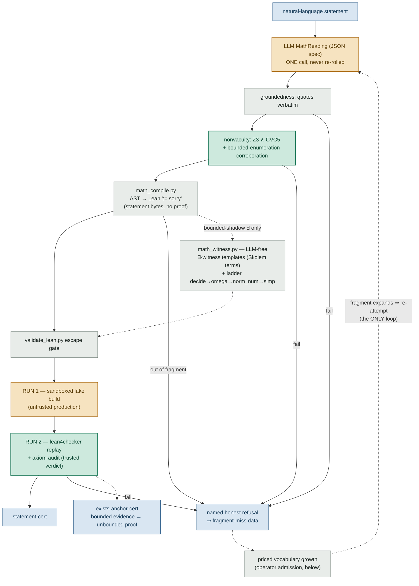
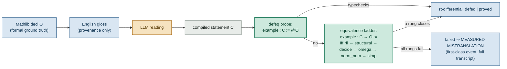
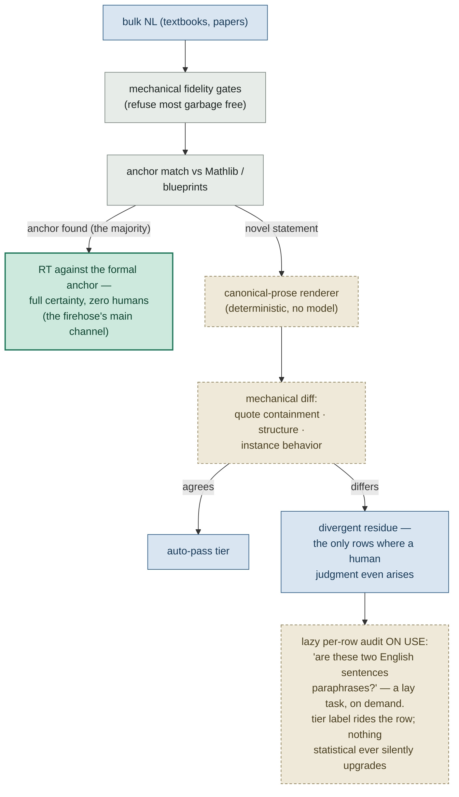
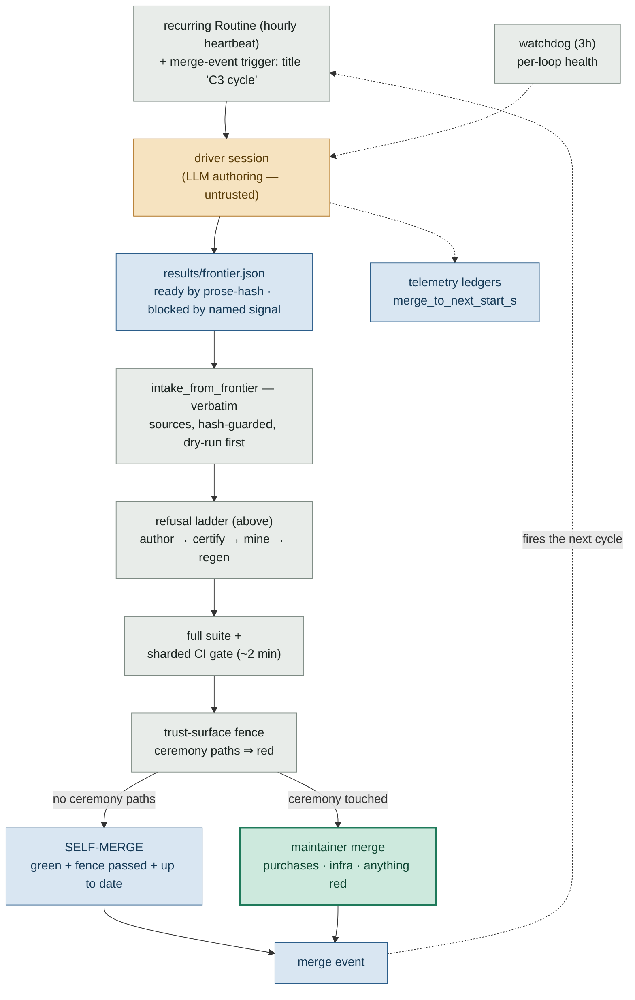

# Certified autoformalization — the visual map

*The LLM may only write **declarative specs**; deterministic machinery
emits everything else; a small fixed **kernel** is the only thing trusted
by fiat.  Nothing is trusted for who produced it — only for what checked
it.  This page maps the machinery onto its real target: **certified
translation between natural language and Lean**.*

*(New to the vocabulary?  [README.md](README.md) in this directory has the
glossary and reading order.)*

Every diagram uses one color code for trust:

| color | meaning |
|---|---|
| 🟨 amber | **untrusted** — LLM output, search results, unchecked code |
| ⬜ grey | **deterministic, still checked** — compilers, gates, emitters |
| 🟩 green | **trusted** — kernel + outsourced checkers |
| 🟦 blue | **data & evidence** — specs, certs, ledgers |
| 🟫 dashed parchment | **proposed** — discussed, not yet built |

## The trust spine: one chokepoint, whatever is being certified

Every artifact class rides the same spine: an untrusted proposer emits
*spec bytes only*; a lexical gate rejects anything that isn't a pure spec;
deterministic machinery turns spec into artifact; the artifact runs
sandboxed; and the kernel adjudicates it against a declared *contract*
with two independent evidence channels.  The spine was proven first on a
deliberately crisp seed domain — binary-format codecs, where the oracle
`decode(encode(x)) == x` is total and mechanical — and the pattern, not
the codecs, is what transfers to Lean.

```mermaid
flowchart LR
  PROP["untrusted proposer<br/>LLM · miner · (proof search)"]:::untrusted
  GATE["spec gate<br/>closed vocabulary, no code"]:::det
  SPEC["parsed spec<br/>(pure data)"]:::evidence
  GEN["deterministic machinery<br/>Spec → Artifact"]:::det
  SBX["sandbox/<br/>namespace jail, no network"]:::det
  K["kernel/<br/>check(artifact, contract)<br/>two independent channels"]:::trusted
  CERT["Certificate | ErrorTranscript"]:::evidence
  REG[("registry:<br/>tiers · provenance · events")]:::evidence

  PROP --> GATE --> SPEC --> GEN -->|artifact| SBX --> K --> CERT --> REG
  CERT -.->|refine, bounded rounds| PROP

  classDef untrusted fill:#F6E3C0,stroke:#A8650B,color:#5A3D08;
  classDef det fill:#E8ECE9,stroke:#7D8A83,color:#1B2420;
  classDef trusted fill:#CDE9DD,stroke:#1E7A5A,color:#0D4531,stroke-width:2px;
  classDef evidence fill:#D9E6F2,stroke:#2B5D8A,color:#163A57;
```

The kernel judges artifacts against contracts, never specs against intent
— that gap is the whole subject of the rest of this page.

## The codec framing: autoformalization is a codec exactly where an equality exists

A codec needs objects, a wire format, an **equality on the objects**, and
a round-trip contract stated against that equality.  Fill in both
directions and the asymmetry is the entire problem:

| component | Formal → NL → Formal (import) | NL → Formal → NL (authoring) |
|---|---|---|
| objects | Lean statements | English statements |
| equality | **defeq / provable ↔** — machine-checkable | paraphrase equivalence — **no decider exists** |
| contract | round-trip, implemented & run *(exists)* | needs a canonical NL form *(proposed)* |

Three lenses, one object: **translation is the claim, codec is the test,
compression is the price.**  The cert asserts a meaning-preserving map;
the round trip checks it; MDL admission pays for the vocabulary that does
it.

## Authoring direction (exists): NL → Lean is a refusal ladder, not a loop

One LLM call authors a `MathReading` (a JSON spec whose demands and
presuppositions must *quote the source verbatim*); everything downstream
is deterministic.  Each stage passes or issues a named honest refusal — no
reroll, because the gates are necessary-condition filters, not oracles,
and iterating against filters optimizes for slipping past them.  The only
loop is outside, slow and priced: refusals are fragment-miss data driving
vocabulary growth, then re-attempt.

The witness branch is the bridge from safe-but-weak (bounded shadow) to
real (kernel-checked unbounded proof); its templates are baby Skolem
functions.

## Import direction (exists, with results): Lean → reading → Lean, a round trip with a real oracle

For a Mathlib declaration the source object is already formal, so the
round trip ends where it can be checked.  The English gloss in the middle
is recorded as provenance and is **never load-bearing** — the cert subject
is the Lean statement.  The RT report on disk (35 declarations): **28
defeq · 1 proved · 4 failed · 2 out-of-surface**.  The *failed* rows are
the prize: fidelity-gates-pass + RT-fail = a measured mistranslation, the
most valuable failure class in the operation.

Implementation: `run/import_rt.py`; results: `results/import_rt_report.json`.
The same oracle extends to blueprint projects (FLT, PFR, …): human formal
anchors that exist before Mathlib has them.

> **Blueprint census (shipped).**  Per blueprint node (prose, Lean
> statement): run the fidelity pipeline on the prose, RT against the
> human's Lean.  A *divergent* node is a statement bug caught before
> anyone proves the wrong theorem — blueprints today track *proved*, not
> *faithfully stated*.  Shipped as the census portfolio (6 corpora, 1008
> nodes at first shipping; see the brief for current counts), each node
> classified attempt-candidate / out-of-fragment (with a named miss
> signal) / no-signal — and those signals are the live mining input: P1
> (bounded big-operators) was purchased off them, and census-sourced
> cycles grow the corpus from attempt-candidates directly.

## Growth: three lanes, by trust depth

Conservative vocabulary (words, macros, tactic *combinations*) is
expansion-defined — provably unable to change what's true — so it can be
admitted automatically under a battery plus pricing.  A genuinely new
decision procedure is a new **trust root** and can never be auto-admitted;
it enters in shadow, permanently paired.  The deep lane writes the new
procedure *in Lean* and proves it sound once — after which its outputs are
theorems, not trusted claims (proof by reflection; how `decide` and
`norm_num` extensions already work).

```mermaid
flowchart TB
  subgraph L1["LANE 1 — conservative (automatic, priced) · exists"]
    ROW["candidate word / macro<br/>definition-as-AST over existing ops"]:::untrusted
    BAT["battery: well-formed · trivial-alias ·<br/>differential instances · compile round-trip<br/>+ (b2) SYMBOLIC: all-values SMT verdicts,<br/>carrier-stability proof or witnessed divergence"]:::det
    PRICE["pricing: strict corpus-DL drop<br/>+ 2 exogenous witnesses"]:::det
    ADM["admitted row — eliminable to the<br/>kernel basis by construction"]:::evidence
  end
  subgraph L2["LANE 2 — new trust root (never automatic) · pattern exists"]
    NEWCHK["new checker (e.g. a prover)"]:::untrusted
    SHADOW["shadow mode: differential agreement<br/>vs existing channels on the overlap"]:::det
    PAIR["admitted PAIRED — never verdicts alone<br/>(how CVC5 sits beside Z3)"]:::trusted
  end
  subgraph L3["LANE 3 — proof by reflection · first slice SHIPPED (S4b)"]
    PROC["procedure written IN Lean"]:::prop
    SOUND["soundness proof, kernel-checked once"]:::prop
    THM["outputs are theorems —<br/>capability grows, TCB does not"]:::prop
  end

  ROW --> BAT --> PRICE --> ADM
  NEWCHK --> SHADOW --> PAIR
  PROC --> SOUND --> THM

  classDef untrusted fill:#F6E3C0,stroke:#A8650B,color:#5A3D08;
  classDef det fill:#E8ECE9,stroke:#7D8A83,color:#1B2420;
  classDef trusted fill:#CDE9DD,stroke:#1E7A5A,color:#0D4531,stroke-width:2px;
  classDef evidence fill:#D9E6F2,stroke:#2B5D8A,color:#163A57;
  classDef prop fill:#EFE9DA,stroke:#8A7B4F,color:#4A3F1E,stroke-dasharray:4 3;
```

Same shape at three layers: operators = statement vocabulary, macros =
reading vocabulary, Lean tactics = proof vocabulary — all
expansion-defined, all conservative.  Ladder growth is monotone: new rungs
re-key certs, never invalidate them.

> **Proof search (proposed).**  The hammer pattern composes LLM and search
> without touching the TCB: the LLM drafts a *sketch* (intermediate
> statements — spec bytes, its permitted artifact class); search closes
> leaves untrusted; every found term is *recorded and replayed* through
> gate → sandbox → lean4checker.  Search-time tools never enter the
> trusted base.  Prior art: Sledgehammer, Draft-Sketch-Prove, AlphaProof.
> The work packet is `PLAN_HAMMER.md`.

> **Reflection targets (first slice shipped).**  Target (1) has its first
> kernel-checked slice: the S4b promotion ceremony admitted `FgReflect`
> (Int v0.1 + the bigop fold layer) into the discharge vocabulary —
> reflection verdicts now ride the Lean lane with an agreement ledger,
> Sigstore-attested per run.  The rest of the ladder, smallest first:
> **(1)** the full Lean-verified decision procedure for the F-G fragment
> (decidable arithmetic — prove `check r = true → ⟦r⟧` once; every
> shadow/instance verdict becomes a theorem); **(2)** a verified checker
> for the witness-template emitter (universal-tier promotion,
> Lean-native); **(3)** the endgame: a verified `math_compile` — compiler
> verification for the reading→Lean translation, which is a
> statement-cert for all outputs at once.  Each is one proof amortized
> over unbounded outputs: the repo's name, running inside the proof
> assistant.

## The definition ladder (proposed beyond L0): growing the language itself

Statements are the trust bottleneck and proofs the effort bottleneck, but
*definitions* are the quality bottleneck — a bad one taxes every future
row.  The ladder grows definition-authorship in rungs, each answering
three questions: where does **conservativity** come from (the guarantee
that new vocabulary can't change what's true), where do the **semantics**
live, and what **prices** admission.  Only L0 exists today; each rung
reuses the machinery below it.

```mermaid
flowchart TB
  L0["L0 — ABBREVIATION WORDS · exists<br/>new: shorthand over existing operators (multiple_of := dvd b a)<br/>conservativity: expansion — eliminable by construction<br/>semantics: none of its own; expanded before any engine sees it<br/>priced: strict corpus-DL descent + 2 exogenous witnesses<br/>battery: (a)–(d) + (b2) symbolic all-values verdicts"]:::det
  L1["L1 — CARRIERS (Real, Prime, …)<br/>new: domains the fragment cannot express at all<br/>conservativity: ANCHOR, don't define — bind to Mathlib's own definitions<br/>semantics: each engine (eval/SMT/Lean) extended, differential-certified<br/>priced: the miss histogram — census names which carrier pays"]:::prop
  L2["L2 — GENUINE DEFINITIONS (binders, recursion)<br/>new: predicates/functions no single expansion can express<br/>conservativity: Lean's def mechanism — kernel-native<br/>semantics: the Lean def is GROUND TRUTH; eval + SMT renderings certified against it<br/>priced: same DL currency; degeneracy gates generalize"]:::prop
  L3["L3 — PROOF-AWARE ECONOMICS<br/>new: nothing is added — the PRICE changes:<br/>a definition is paid by statement AND proof shrinkage,<br/>because good definitions shorten proofs more than statements"]:::prop
  L4["L4 — MINING FROM MISS CLUSTERS<br/>new: proposals, never admissions —<br/>when many nodes miss in one category, the cluster NAMES the concept<br/>(LIVE: frontier.json's blocked groups already name each unblocking purchase)"]:::prop
  L5["L5 — ABSTRACTION MINING OVER PROOF TERMS<br/>DreamCoder/Stitch for mathematics: find the repeated proof structure<br/>a new lemma or concept would compress; admit it under the same<br/>witness + DL-descent gate — where definition authorship and the<br/>compression tower finally meet"]:::prop

  L0 --> L1 --> L2 --> L3 --> L4 --> L5

  classDef det fill:#E8ECE9,stroke:#7D8A83,color:#1B2420;
  classDef prop fill:#EFE9DA,stroke:#8A7B4F,color:#4A3F1E,stroke-dasharray:4 3;
```

Each rung keeps the invariant that made L0 safe — new vocabulary can never
change what's true, only what's short — while moving the conservativity
guarantee from expansion (L0) to anchoring (L1) to Lean's kernel (L2), and
the pricing from statements (L0–L2) to proofs (L3–L5).

## Endgame (proposed): meet in the middle, then triage the firehose

The NL gap never closes; it shrinks and relocates.  The reading is the
meeting point — human-auditable (verbatim quotes), machine-checkable
(three deterministic renderings that must agree).  The missing half of the
authoring codec is a **deterministic canonical-prose renderer**: reading →
one fixed English sentence, no model.  Then bulk NL triages mechanically,
and no human ever faces the firehose:

Back-translation, dismantled: compare structure and behavior mechanically;
leave only connotation to humans, per-row, on use.  The renderer converts
an expert bottleneck (read Lean) into a commodity judgment (compare two
sentences).

> **Why being wrong stays cheap (R1–R4).**  **R1** identity =
> (decl, statement-hash), readings are caches — re-validation after any
> format change is CPU, not tokens.  **R2** provenance keeps every
> decision, so nothing restarts from zero.  **R3** every macro layer is
> eliminable down to the kernel basis — the corpus always rewrites to
> ground form.  **R4** a format migration ships with a proven
> universal-tier migrator, or fails CI.  Cost of a wrong encoding: one
> proof, never the corpus.

## The flywheel (exists): the loop runs itself — fast everywhere except through the fence

Since the C2/C3 rewiring, mining is driven by **recurring cloud
Routines**, not by hand.  Sessions ship on platform-assigned branches, so
cycle identity rides **PR titles** (`C3 cycle…` / `C3 purchase…`).  A
cycle reads the committed census-derived **frontier** (ready sources by
prose-hash, blocked groups by named miss signal — the signal names the
purchase that unblocks them), intakes verbatim sources mechanically,
authors and certifies readings through the refusal ladder above, and
ships a PR behind the full gate.

Merging is where trust asserts itself.  Corpus PRs **self-merge** when
every check is green, the `trust-surface` check passed, and the branch is
up to date with main — and the merge *event* fires the next cycle, so the
schedule is only a heartbeat.  Any diff touching a ceremony surface
(`kernel/certs.py`, `TRUST.md`, the growth registry, the CI/automation
config itself) goes trust-surface **red and waits for the maintainer** —
which is why every full-bill purchase is maintainer-merged by design: the
registry row lives in `buildloop/growth_protocol.py`.  A 3-hourly
watchdog health-checks each loop independently; a stop-gate hook refuses
to let a cycle session end without shipping, salvaging, or stating an
honest no-op; per-cycle telemetry ledgers record where the wall-clock
goes, with merge-to-next-start as the number under attack.

Trust roots never grow by economics: the loop self-merges only what the
fence clears; the growth registry, kernel pins, `TRUST.md`, and the
automation config itself always force a human merge.  `C3_PROMPTS.md` is
the prompts' single source of truth — the Routines hold only pointers.

## Map of the tree: where the Lean effort lives

| path | trust | role |
|---|---|---|
| `kernel/` | trusted | `check(artifact, contract)`; wraps Z3, CVC5, Hypothesis, Dafny, and the Lean two-run backend (sandboxed build, then `lean4checker` replay + axiom audit).  Enumerated line-by-line in `TRUST.md`. |
| `sandbox/` | trusted | The real security boundary: Linux namespaces, no network, tmpfs, rlimits.  Lexical gates are fast-fail only. |
| `generators/math_*` | deterministic | One frozen grammar (`math_reading`), four translations that must agree: Lean text (`math_compile`), SMT (`math_smt`), Python eval (`math_eval`), proof terms (`math_witness`).  Divergence between them is a first-class recorded event. |
| `generators/operator_growth.py` | deterministic | Lane-1 vocabulary admission: expansion-defined words, the battery, DL pricing, the two-witness rule. |
| `run/formalize.py` · `run/import_rt.py` | deterministic | The authoring refusal ladder and the import RT oracle.  Zero LLM at task time, enforced. |
| `buildloop/` | **LLM here** | `llm.py` is the only LLM chokepoint (token-billed); `import_driver.py` runs budgeted Mathlib waves; `validate_lean.py` is the Lean escape gate. |
| `specs/mathsources/` · `results/` | evidence | The sentence corpus, admitted operators, import ledger, RT report, and the honestly-kept findings file (including its preserved wrong diagnosis). |
| `tools/` | deterministic | The cycle instruments: census portfolio → frontier → mechanical intake → downstream regen → telemetry → `session_brief.py` (recompute beats recollection). |
| `C3_PROMPTS.md` · `.claude/hooks/` | evidence | The cadence law: driver / purchase / watchdog prompts (Routines hold only pointers, so prompt fixes ship by merge); the stop-gate attestation hook; the SessionStart guards with the bundle-salvage protocol. |
| `.github/workflows/` | deterministic | The gate fabric: the sharded fast matrix (~2 min), `trust-surface` (the ceremony fence — its own workflow, so a missing check means tampering), sharded Lean lanes primed from a per-pin toolchain image, once-per-pin recertification ledgers. |
| `generators/` (codec arm) | — | The seed domain: Kaitai/tree-sitter codec generators where the spine was first proven.  The pattern transferred; the codecs themselves are scaffolding. |

---

*Drawn from `run/formalize.py` · `run/import_rt.py` ·
`generators/operator_growth.py` · `PLAN_LEAN_IMPORT.md` · `TRUST.md` ·
`C3_PROMPTS.md` · `tools/` · `results/`.  Solid = exists · dashed
parchment = proposed.  Point-in-time numbers (RT report rows, corpus
counts) date from the post-flywheel refresh; `python3
tools/session_brief.py` is the current reading.*
